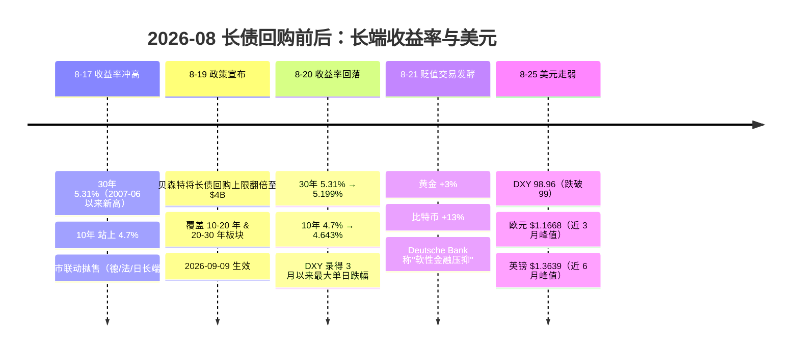

# 财政主导（Fiscal Dominance）

## 连接何在

[[concepts/财政货币化|财政货币化]] 页讲的是央行印钞为财政融资的**具体操作**，[[concepts/美联储独立性|美联储独立性]] 页讲的是央行抵御政治压力的**制度设计**，[[synthesis/国债收益率 × 利率 × 汇率|国债收益率 × 利率 × 汇率]] 页则记录了 2026-08 长债回购压低收益率、触发"美元贬值交易"的**事件**。但单看任何一页，都缺一个把它们串起来的**上位概念**：**财政主导（fiscal dominance）**。

财政主导不是某个操作，而是一种**制度状态**——当政府债务规模大到货币当局无法再"说不"时，货币政策就从"独立锚定通胀"退化为"配合财政融资"。它是财政货币化的**前提条件**（财政主导下才可能滑向财政货币化），是央行独立性的**反面**（独立性被侵蚀的终点），也是 2026 年长债回购事件背后的**结构性解释**（为什么财政部敢压收益率、为什么市场会恐慌）。

MSCI 在 2026-01 将财政主导列为 2026 全球利率的头号关键因素。本页回答的核心问题是：**什么是财政主导？它如何从"学术概念"变成 2026 年美元资产定价的现实约束？** ^[inferred]

需要与既有页面划清分工：[[concepts/财政货币化]] 回答"央行怎么印钞给财政"，本页回答"为什么央行会失去拒绝印钞的能力"；[[concepts/美联储独立性]] 回答"央行如何保持独立"，本页回答"独立性在什么条件下崩塌"。前者是操作，后者是制度；前者是手段，后者是状态。本页是这三者的**理论底座**。

## 核心定义

**财政主导（fiscal dominance）**：当政府债务/GDP 高到一定程度，货币当局被迫以牺牲价格稳定为代价来维持财政可持续——压低名义利率、容忍通胀、甚至直接为财政融资。与之相对的是**货币主导（monetary dominance）**：央行以价格稳定为首要目标，财政必须适应货币政策。

Sargent & Wallace (1981) 的" unpleasant monetarist arithmetic"（不愉快的货币主义算术）是经典理论：若财政赤字不可持续，无论央行现在是否印钞，**最终**都必须通过通胀税来平衡——货币主导只是"推迟"而非"避免"财政主导。

## 财政主导 vs 财政货币化 vs 央行独立性

| 概念 | 层次 | 定义 |
|------|------|------|
| **财政主导** | 制度状态 | 货币当局被财政赤字绑架，失去独立锚定通胀的能力 |
| **财政货币化** | 具体操作 | 央行印钞直接/间接为财政融资（见 [[concepts/财政货币化]]） |
| **央行独立性** | 制度设计 | 央行抵御政治/财政压力的制度安排（见 [[concepts/美联储独立性]]） |

三者关系：**财政主导是财政货币化的前提**（只有财政主导下，央行才会被迫货币化）；**央行独立性是财政主导的解药**（独立性越强，越能抵抗财政主导）。财政主导是"病"，财政货币化是"症状"，央行独立性是"疫苗"。

## 财政主导的传导机制

### 通道一：压低名义利率 → 实际利率下降 → 资本外流

当财政主导下央行/财政部压低长端收益率（如 2026-08 长债回购），名义利率下降而通胀预期不变 → **实际利率下降** → 持有该国资产的实际回报缩水 → 资本外流 + 黄金/比特币上涨。这是 [[synthesis/国债收益率 × 利率 × 汇率|国债收益率 × 利率 × 汇率]] 页场景二的核心机制。

### 通道二：通胀税 → 稀释债务实际价值

财政主导的终极手段是通胀：通过推高物价，稀释名义债务的实际价值（"通胀税"）。储户和债券持有人承担成本。这正是"debasement"（贬值/掺水）的本义——见 [[concepts/美元贬值交易|美元贬值交易]]。

### 通道三：汇率贬值 → 调整压力外移

当国内收益率被压制、通胀被容忍，调整压力会转移到**汇率**上——本币贬值。2026-08 的"美元贬值交易"正是这一通道的实证：财政部压长端收益率，市场预期美元贬值（黄金+3%、比特币+13%、DXY 跌破 99）。

## 2026 年美国的财政主导信号

### 结构性信号

- **债务规模**：美国债务逼近 $40T，7月赤字 $4320亿（+48%）
- **期限溢价抬升**：10年期期限溢价升至 1.02%——市场对财政可持续性定价
- **MSCI 2026-01**：将财政主导列为 2026 全球利率头号关键因素

### 政策信号（2026-08 长债回购）

- **2026-08-19**：贝森特将长债回购上限翻倍至 $4B，压低长端收益率
- **市场解读**：Deutsche Bank 称"软性金融压抑"（soft-form financial repression）；Robin Brooks 警告可能打开日元式贬值螺旋
- **政治动机**：中期选举前压低长端收益率/房贷利率利好特朗普政府——这正是财政主导的典型特征：**货币政策/财政操作服务于政治周期而非价格稳定**

#### 2026-08 长债回购前后收益率时间线

> **读图要点**：回购政策（8-19）压低长端收益率（8-20 回落）→ 实际利率下降 → 调整压力转移到美元（8-21 起黄金/比特币上涨、8-25 DXY 跌破 99）。这正是财政主导"压低收益率→汇率贬值"传导链的实证——见 [[synthesis/国债收益率 × 利率 × 汇率]] 与 [[concepts/美元贬值交易]]。

## 历史案例

### 日本（1990s-2020s）

日本是财政主导的长期样本：债务/GDP 超 200%，央行长期压低收益率（YCC），日元长期贬值。Robin Brooks 警告美国可能重蹈覆辙——"日元式贬值螺旋"。

### 拉美（1980s）

Sargent & Wallace 理论的经典实证：拉美国家财政赤字失控 → 央行被迫印钞 → 恶性通胀。萨克斯（[[entities/萨克斯]]）早年研究恶性通胀与财政主导的分析框架正源于此。

### 欧债危机（2010s）

欧元区边缘国（希腊等）财政失控 → 央行（ECB）被迫以 OMT 等工具"以承诺灭火"——财政主导在货币联盟内的特殊形态（见 [[concepts/欧债危机]]）。

## 财政主导 vs 美元霸权

财政主导对美元有**结构性侵蚀**作用：当市场不再相信美国能控制赤字，美元作为储备货币的信用基础动摇。这与 [[concepts/美元霸权|美元霸权]]、[[concepts/去美元化|去美元化]] 直接相关——财政主导是美元霸权从内部瓦解的路径之一。

**关键悖论**：美元霸权（储备货币地位）本应让美国能以低成本融资，但财政主导恰恰利用了这一特权——过度依赖"过度特权"（Exorbitant Privilege）融资，最终反噬信用本身。

## 与本次四页的关系

- [[synthesis/国债收益率 × 利率 × 汇率]]：财政主导是长债回购→美元贬值传导链的**结构性解释**
- [[concepts/国债回购]]：财政主导下的政策工具（压低收益率）
- [[concepts/美元贬值交易]]：财政主导的市场定价（debasement trade）
- [[sources/2026-08-19-贝森特长债回购计划]]：财政主导的 2026-08 实证事件

## 待深化

- [ ] 量化美国财政主导的临界点（债务/GDP 阈值）
- [ ] 对比日本 YCC 与美国长债回购的财政主导强度
- [ ] 评估财政主导对美元储备货币地位的中长期影响
- [ ] 跟踪 2026-09-09 回购生效后的实际效果
